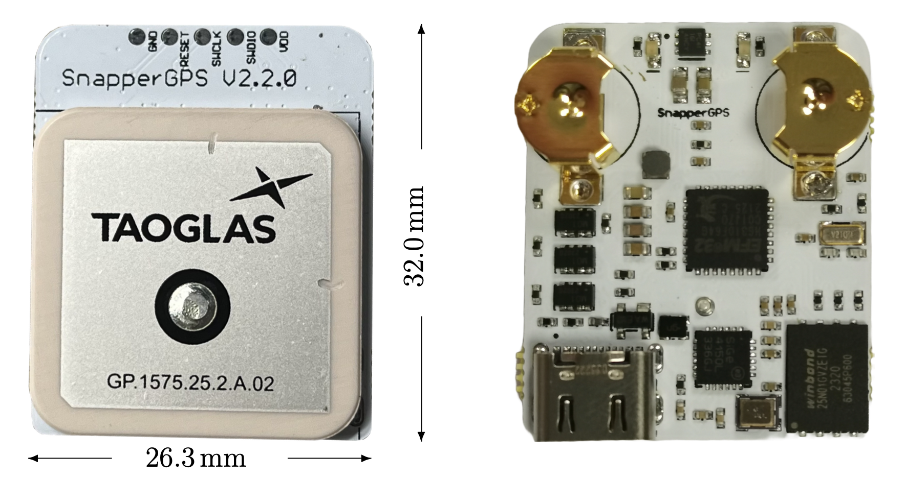

# snappergps-pcb-2-2-LiPo

This is an alternative version of the original SnapperGPS receiver.
Just like [V1.0.0](https://github.com/SnapperGPS/snappergps-pcb), [V2.0.0](https://github.com/SnapperGPS/snappergps-pcb-2), [V2.1.0](https://github.com/SnapperGPS/snappergps-pcb-2-1), and [V2.1.2](https://github.com/SnapperGPS/snappergps-pcb-2-2) it is a small, low-cost, and low-power GNSS receiver intended for non-real-time wildlife tracking.
It employs the snapshot GNSS technology, which offloads the computational expensive data processing to the cloud, and:

* Measures 26.3 mm x 28.5 mm,

* Operates on a lithium-ion polymer battery,

* Weighs about 8 g (without the battery),

* Has enough memory to provide about 22,000 position fixes,

* Captures fixes in user-defined time intervals or externally triggered,

* Needs only 12 ms of signal reception for a fix,

* Employs multiple satellite systems for high reliability (GPS, Galileo, and BeiDou),

* Achieves a median real-world tracking accuracy of about 15 m (before smoothing),

* Maintains a real-time clock to accurately timestamp the fixes,

* Measures the temperature in addition, and

* Is configured via USB in your browser without the need to install a driver or an app.

This repository contains the hardware design files that can be used to replicate a SnapperGPS receiver V2.2.0-LiPo.

If you use SnapperGPS hardware or software for research, please consider citing our publications.

For the hardware:

> Jonas Beuchert, Amanda Matthes, and Alex Rogers. 2023. SnapperGPS: Open Hardware for Energy-Efficient, Low-Cost Wildlife Location Tracking with Snapshot GNSS. Journal of Open Hardware, 7(1): 2, pp. 1–13. [https://doi.org/10.5334/joh.48](https://openhardware.metajnl.com/articles/10.5334/joh.48/).

For the cloud-processing software:

> Jonas Beuchert and Alex Rogers. 2021. SnapperGPS: Algorithms for Energy-Efficient Low-Cost Location Estimation Using GNSS Signal Snapshots. In SenSys ’21: ACM Conference on Embedded Networked Sensor Systems, November, 2021, Coimbra, Portugal. ACM, New York, NY, USA, 13 pages. https://doi.org/10.1145/3485730.3485931.


|  | 
|:--:| 
| *Figure 1: Top view (left) and bottom view (right) of assembled SnapperGPS receivers V2.2.0 with a passive ceramic patch antenna and holders for two LR48 or SR48 button cells. This version is similar to V2.1.0, but smaller.* |

**Table of Contents**

1. [Changes from previous versions](#changes-from-previous-versions)

2. [Workflow](#workflow)

3. [Getting started](#getting-started)

4. [Repository Structure](#repository-structure)

5. [Professional Manufacturing](#professional-manufacturing)

6. [Hand Assembly](#hand-assembly)

7. [Testing](#testing)

8. [Hardware Overview](#hardware-overview)

9. [Pinout](#pinout)

10. [Bill of Materials](#bill-of-materials)

11. [Additional Resources](#additional-resources)

## Changes from previous versions

The main changes from V1.0.0 are:

* The antenna is integrated into the PCB. No external active antenna is used anymore.

* The board is a bit smaller with 26.3 mm x 28.5 mm and this now includes the antenna.

* The memory is large enough to collect data for 22,000 fixes. Initially, V1.0.0 only supported a smaller memory for 11,000 fixes, although, it can now be upgraded to the larger memory version, too.

* The board (including antenna and excluding battery) weighs around 8 g. Depending on the choice of antenna and battery, this can be heavier or lighter than V1.0.0.

The main changes from V2.0.0 are:

* An optional external active antenna cannot be used anymore.

* No general-purpose input/output (GPIO) pins are exposed. Therefore, no daughter-board can be connected.

* The board is a bit smaller with 26.3 mm x 28.5 mm.

* The board does not have an option to use a thicker 4 mm antenna, just a thinner 2 mm antenna. This reduces signal quality in contrast to V2.0.0 with the 4 mm antenna.

* The board operates on a lithium-ion polymer battery rather than on coin cells.

The main changes from V2.1.0 and V2.2.0 are:

* The board is a bit smaller with 26.3 mm x 28.5 mm.

* The board operates on a lithium-ion polymer battery rather than on coin cells.

## Workflow

- Get/build your SnapperGPS receiver (see sections below).
- [Configure](https://snappergps.info/configure) your SnapperGPS receiver in your browser for your deployment.
- Deploy your SnapperGPS receiver.
- The SnapperGPS receiver captures GNSS snapshots according to your configuration.
- Recover your SnapperGPS receiver.
- [Upload](https://snappergps.info/upload) the data from your SnapperGPS receiver to our server.
- [Download](https://snappergps.info/view) the track of your surveilled animal.

## Getting started

You already have a SnapperGPS receiver?
See [here](GETTING-STARTED.md) how to get started.
The instructions are for V1.0.0, but V2.2.0-LiPo works very similar.

You need to build a receiver first? Keep reading.

## Repository Structure

The two files `.brd` and `.sch` are CAD files that contain the PCB's board design and schematic, respectively. They have been created with Autodesk EAGLE 9.6.2, but should be compatible with other electronic design software.

The directory `CAMOutputs` includes the Gerber files and drill file, which are necessary for PCB manufacturing.

The two files `.mnb` and `.mnt` can be used for a pick-and-place machine and describe the component positions and orientations on the bottom and top layer, respectively.

## Professional Manufacturing

The simplest way to replicate SnapperGPS is to upload the BOM, the Gerber files, the drill file, and the pick and place files to an online PCB manufacturing and assembly service. They will source the components, print the PCB, and assemble the board.

We recommend a thickness between 0.8 and 1.6 mm for the four-layered board. The thinner, the lighter.
The substrate can be FR-4 and hot air solder leveling (HASL) or electroless nickel immersion gold (ENIG) can be used for the finish.

You can find an FAQ on prefessional manufacturing in [the discussions forum](https://github.com/orgs/SnapperGPS/discussions/22).

## Hand Assembly

An alternative to prefessional manufacturing is to just obtain the SnapperGPS PCB from a PCB manufacturer and to manually assembly the board.
Hand-soldering a board takes less than 2 h for a skilled person, but requires intermediate equipment and skills and potentially additional time for testing, debugging, and re-work.

You can find instructions [here](https://github.com/SnapperGPS/snappergps-pcb/blob/main/README.md#hand-assembly).

## Testing

Some basic testing:

* Open [the SnapperGPS web app](https://snappergps.info) in Microsoft Edge or Google Chrome or download it from [the Microsoft Store](https://apps.microsoft.com/store/detail/snappergps/9P9RPRS6LSMM) or [Google Play](https://play.google.com/store/apps/details?id=com.herokuapp.snapper_gps.twa). (Alternatively, you can also host the SnapperGPS web app yourself, as described in [the _snappergps-app_ repository](https://github.com/SnapperGPS/snappergps-app)).

* Go to the *Configure* page and click/tap on *Pair receiver*.

* The connected SnapperGPS receiver should now be selectable in a pop-up window.

* After pairing, confirm that the receiver information in the table on the top of the page is appropriate, including on-board time and firmware version. The snapshot count should be zero.

* Check the measured battery voltage in the table at the top of the *Configure* page. We recommend around 3 V before a long-term deployment.

* Select some configuration parameters in the app and click/tap on *Configure*.

* Disconnect the SnapperGPS receiver.

* Record a few snapshots outdoors.

* Reconnect the SnapperGPS receiver.

* Go to the *Upload* page and follow the instructions to upload the snapshots from the SnapperGPS receiver to the server. Please select only snapshots for processing that you collected outdoors.

* Once processing is complete, inspect the calculated track on the *Download* page. There are also links to some of our tracks for comparison.

Testing the localisation accuracy:

* Record some data outdoors at a location with known coordinates.

* Upload it via the SnapperGPS app.

* Calculate the horizontal error between the estimated locations and the ground truth.

* We obtained median errors of 10-12 m, depending on the scenario.

Measuring the power consumption:

* Configure a SnapperGPS receiver using the SnapperGPS app.

* Power the SnapperGPS receiver from an external DC source with 3 V.

* Place an ammeter in series with the source.

* The current should be around 1 μA if the board is sleeping and the maximum current should be around 25 mA when capturing a snapshot. The charge consumption for a single snapshot should be <0.3 μAh.

Testing the flash memory:

* Record the maximum of 21824 snapshots.

* Transfer them to a host computer using the *Transfer data* button on the *Upload* page of the SnapperGPS web app.

* Ensure that all 21824 snapshots have been transferred and are provided as download.

## Hardware Overview

Please have a look at our [paper](https://doi.org/10.5334/joh.48).

## Pinout

We expose the VDD, GND, RESET, SWCLK, and SWDIO pins of the MCU on the the PCB.
The last two allow for debugging or flashing using [Serial Wire Debug (SWD)](https://community.silabs.com/s/article/serial-wire-debug-swd-x).
All five circular pads have a spacing of 0.1 in and, hence, the same as common PCB headers.

All five pads are labelled on the silkscreen of the PCB.

```
┌───────────────────────────────┐
│   ○     ○     ○     ○     ○   │
│  GND  RESET SWCLK SWDIO  VDD  │
│                               │
```

## Bill of Materials

The table below lists the electronic components that are needed to assemble a single SnapperGPS board.

|Designator                                    |Qty|Manufacturer                  |Part #                                 |Description/Value                                            |Package/Footprint|Mounting Type|Notes                                                                          |Supplier URL                                                                                           |
|----------------------------------------------|--:|------------------------------|---------------------------------------|-------------------------------------------------------------|-----------------|-------------|-------------------------------------------------------------------------------|-------------------------------------------------------------------------------------------------------|
|C4, C8, C10, C12, C13, C14, C16, C17, C20, C23| 10|Murata                        |GRM155R60J104KA01D                     |Ceramic capacitor, 100 nF                                    |0402             |SMD          |                                                                               |https://www.digikey.com/en/products/detail/murata-electronics/GRM155R60J104KA01D/490-6287-1-ND/3845484 |
|C3, C5, C6, C7, C9                            |  5|Murata                        |GRM155R60J103KA01D                     |Ceramic capacitor, 10 nF                                     |0402             |SMD          |                                                                               |https://www.digikey.com/en/products/detail/murata-electronics/GRM155R60J103KA01D/490-6286-1-ND/3845483 |
|C21, C22                                      |  2|Murata                        |GRM1555C1H180JA01D                     |Ceramic capacitor, 18 pF                                     |0402             |SMD          |                                                                               |https://www.digikey.com/en/products/detail/murata-electronics/GRM1555C1H180JA01D/2854383               |
|C11, C19, C124, C125                          |  4|Murata                        |GRM188R60J105KA01D                     |Multi-layer ceramic capacitor, 1 uF, 6.3 V, X5R              |0603             |SMD          |                                                                               |https://www.digikey.com/en/products/detail/murata-electronics/GRM188R60J105KA01D/490-1550-1-ND/587755  |
|C18, C101, C102                               |  3|Murata                        |GRM185R60J475ME15D                     |Multi-layer ceramic capacitor, 4.7 uF, 6.3 V, X5R            |0603             |SMD          |                                                                               |https://www.digikey.com/en/products/detail/murata-electronics/GRM185R60J475ME15D/490-3892-1-ND/965934  |
|C15                                           |  1|Murata                        |GRM188R60J106KE47D                     |Multi-layer ceramic capacitor, 10 uF, 6.3 V, X5R             |0603             |SMD          |                                                                               |https://www.digikey.com/en/products/detail/murata-electronics/GRM188R60J106KE47D/490-12538-1-ND/5797528|
|L2                                            |  1|Murata                        |BLM15HB221SH1D                         |Ferrite bead                                                 |0402             |SMD          |                                                                               |https://www.digikey.com/en/products/detail/murata-electronics/BLM15HB221SH1D/6798444                   |
|R11, R12                                      |  2|Yageo                         |RC0402FR-0715RL                        |Resistor, 15R                                                |0402             |SMD          |                                                                               |https://www.digikey.com/en/products/detail/yageo/RC0402FR-0715RL/311-15LRCT-ND/2827914                 |
|R15, R16, R120                                |  3|Yageo                         |RC0402FR-071KL                         |Resistor, 1K                                                 |0402             |SMD          |                                                                               |https://www.digikey.com/en/products/detail/yageo/RC0402FR-071KL/726513                                 |
|R10, R13, R17                                 |  3|Yageo                         |RC0402FR-074K7L                        |Resistor, 4K7                                                |0402             |SMD          |                                                                               |https://www.digikey.com/en/products/detail/yageo/RC0402FR-074K7L/311-4-7KLRCT-ND/2827881               |
|R7, R8                                        |  2|Yageo                         |RC0402FR-075K1L                        |Resistor, 5K1                                                |0402             |SMD          |                                                                               |https://www.digikey.com/en/products/detail/yageo/RC0402FR-075K1L/726624                                |
|R18                                           |  1|Yageo                         |RC0402FR-076K8L                        |Resistor, 6K8                                                |0402             |SMD          |                                                                               |https://www.digikey.com/en/products/detail/yageo/RC0402FR-076K8L/311-6-80KLRCT-ND/729589               |
|R14, R19                                      |  2|Yageo                         |RC0402FR-0710KL                        |Resistor, 10K                                                |0402             |SMD          |                                                                               |https://www.digikey.com/en/products/detail/yageo/RC0402FR-0710KL/726523                                |
|R121                                          |  1|Yageo                         |RC0402FR-0725K5L                       |Resistor, 25.5K                                              |0402             |SMD          |                                                                               |                                                                                                       |
|R1, R2, R3, R4, R5, R6, R9                    |  7|Yageo                         |RC0402FR-07100KL                       |Resistor, 100K                                               |0402             |SMD          |                                                                               |https://www.digikey.com/en/products/detail/yageo/RC0402FR-07100KL/311-100KLRCT-ND/729473               |
|Q2                                            |  1|Jauch Quartz                  |Q 0,032768-JTX310-12,5-10-T1-HMR-50K-LF|Crystal, 32.768 kHz ±10 ppm, 12.5 pF, 50 kOhm                |2-SMD            |SMD          |Possible substitute: Epsom, X1A0001410004 FC-135R 32.768KHZ 9PF                |https://www.digikey.com/en/products/detail/jauch-quartz/Q-0-032768-JTX310-12-5-10-T1-HMR-50K-LF/8108077|
|D1                                            |  1|Rohm Semiconductor            |SML-D12M1WT86                          |LED, yellow-green, 572 nm, 2.2 V                             |0603             |SMD          |                                                                               |https://www.digikey.com/en/products/detail/rohm-semiconductor/SML-D12M1WT86/SML-D12M1WT86CT-ND/5843861 |
|D2                                            |  1|Rohm Semiconductor            |SML-D12U1WT86                          |LED, red, 620 nm, 2.2 V                                      |0603             |SMD          |                                                                               |https://www.digikey.com/en/products/detail/rohm-semiconductor/SML-D12U1WT86/SML-D12U1WT86CT-ND/5843858 |
|TCXO1                                         |  1|Connor Winfield               |D32G-016.368M                          |Temperature compensated oscillator, 16.384 MHz               |3.2x2.5          |SMD          |Possible substitutes: EPSON, X1G005441030112 or TXC Corporation, 7Q-16.368MBG-T|https://www.digikey.com/en/products/detail/connor-winfield/D32G-016-368M/3641696                       |
|U2                                            |  1|Skyworks Solutions Inc.       |SE4150L-R                              |RF receiver                                                  |24-QFN           |SMD          |                                                                               |https://octopart.com/se4150l-r-skyworks+solutions-20439429                                             |
|SAW1                                          |  1|Abracon LLC                   |AFS20A42-1575.42-T3                    |SAW filter, 1.575 GHz, BW 42 MHz                             |4-SMD            |SMD          |                                                                               |https://www.digikey.com/en/products/detail/abracon-llc/AFS20A42-1575-42-T3/535-12069-1-ND/4075659      |
|U1                                            |  1|Silicon Labs                  |EFM32HG310F64G-C-QFN32R                |Microcontroller                                              |32-QFN           |SMD          |Possible substitutes: EFM32HG310F64G-A-QFN32R or EFM32HG310F64G-B-QFN32R       |https://www.digikey.com/en/products/detail/silicon-labs/EFM32HG310F64G-C-QFN32R/336-6165-1-ND/10314104 |
|U3                                            |  1|Nexperia                      |PRTR5V0U2AX,235                        |TVS diode, 5.5 V                                             |SOT143B          |SMD          |                                                                               |https://www.digikey.com/en/products/detail/nexperia-usa-inc/PRTR5V0U2AX235/1727-5862-1-ND/2698064      |
|IC1                                           |  1|Winbond Electronics           |W25N01GVZEIG                           |NAND flash, 1 GBit                                           |WSON-8           |SMD          |Possible substitute:  W25N512GVEIG (512 MBit)                                  |https://www.digikey.com/en/products/detail/winbond-electronics/W25N01GVZEIG-TR/5803931                 |
|Q1, Q3, Q4                                    |  3|Rohm Semiconductor            |TT8M1TR                                |Mosfet array N and P-channel, 20 V, 2.5 A, 1 W               |8-SMD            |SMD          |                                                                               |https://www.digikey.com/en/products/detail/rohm-semiconductor/TT8M1TR/5042837                          |
|J1                                            |  1|JAE Electronics               |DX07S016JA1R1500                       |USB-C receptacle connector, 24 Pins (16+8 dummy), right angle|                 |through-hole |                                                                               |https://www.digikey.com/en/products/detail/jae-electronics/DX07S016JA1R1500/11585731                   |
|ANT1                                          |  1|Taoglas                       |GP.1575.25.2.A.02                      |GPS/GALILEO patch antenna                                    |25x25            |through-hole |                                                                               |https://www.digikey.com/en/products/detail/taoglas-limited/GP-1575-25-2-A-02/2332643                   |
|U104                                          |  1|Ablic Inc.                    |S-1318D33-M5T1U4                       |3.3 V 100 mA voltage regulator                               |SOT-23-5         |SMD          |                                                                               |                                                                                                       |
|U105                                          |  1|Microchip Technology          |MCP73831T-2ACI/OT                      |Lithium-ion polymer battery charger                          |SOT-23-5         |SMD          |                                                                               |                                                                                                       |
|                                              |   |                              |                                       |                                                             |                 |             |                                                                               |                                                                                                       |

The BOM differs slightly from the one for initial SnapperGPS test boards, which was cheaper.
For example, we used cheaper TCXOs, the X1G005441030112 manufactured by EPSON or the 7Q-16.368MBG-T from the TXC Corporation, which cost around $2 instead of the expensive D32G-016.368M that costs $7-$8.
We had to introduce this change because of the on-going global supply chain disruptions and recommend to revert to one of the initial choices for replications, if possible, to reduce the overall cost.

## Additional resources

## Acknowledgements

This SnapperGPS receiver version was developed and is maintained by
[Jonas Beuchert](https://users.ox.ac.uk/~kell5462/).

##

This documentation is licensed under a
[Creative Commons Attribution 4.0 International License][cc-by].

[![CC BY 4.0][cc-by-image]][cc-by]

[cc-by]: http://creativecommons.org/licenses/by/4.0/
[cc-by-image]: https://i.creativecommons.org/l/by/4.0/88x31.png
